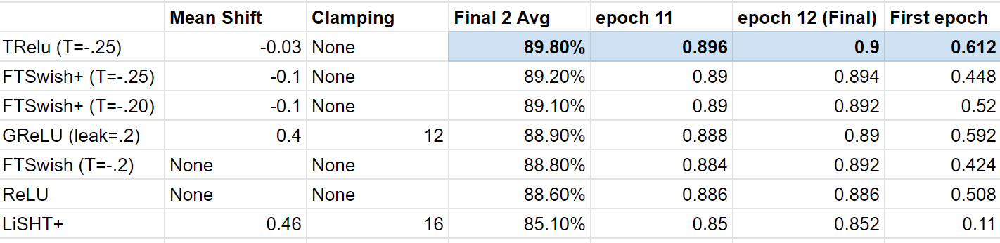

# TRelu
An improved activation function for deep learning - Threshold Relu, or TRelu

Threshold Relu (TRelu) came about as a result of a week long comparison testing of a variety of activation functions (Relu, General Relu, FTSwish, LiSHT and enhancements of these).  As a result of question from those results on the FastAI forums wondering about a merge of Relu and FTSWish (the previous winner) would look like (credit to Yonatan365), TRelu was coded up and born and immediately topped the charts in terms of the previous weeklong competition.  Testing on more and larger datasets is now underway.

# What is TRelu?    
TRelu is Relu but with two important changes:

1 - Negative values are allowed, but all are capped to the threshold (default is - .25).  This allows the expression of negatives during activation, but only to a fixed limit.  This appears to be the main driver of the improved accuracy.

2 - Mean shifting - Based on the mean shift concept introduced by FastAI/Jeremy Howard.  Basically the mean is tested on random tensor initialized to Kaiming Init for Relu, and run through the activation (in this case, TRelu).  A shift is then determined and added so that the actual mean of this Kaiming Init for weights is driven to zero.  The concept is that by ensuring a starting mean of zero, training can proceed more readily.
For TRelu, that default value is - .03

